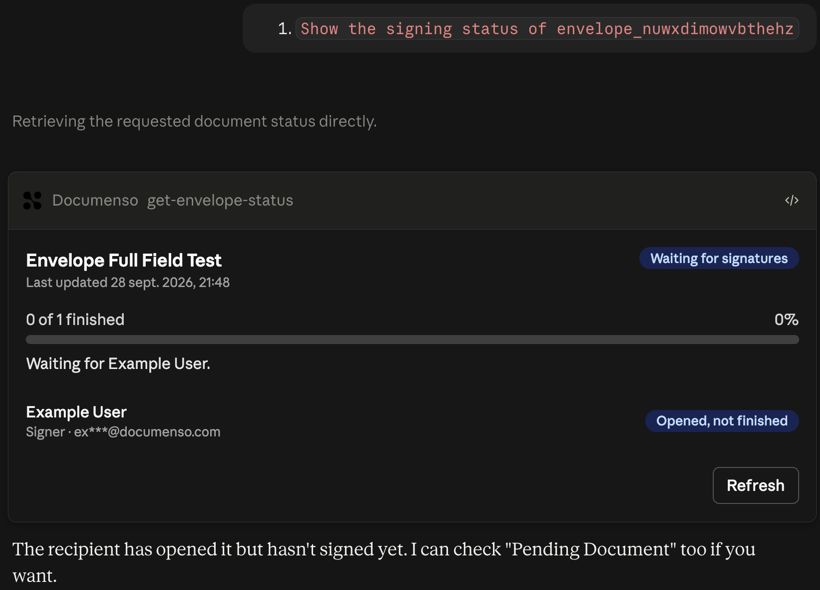
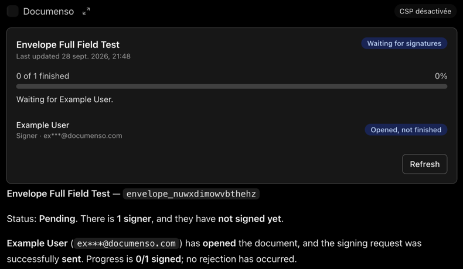

# documenso-mcp

A team-scoped [MCP](https://modelcontextprotocol.io) server for [Documenso](https://github.com/documenso/documenso), built with [mcp-use](https://docs.mcp-use.com). It lets ChatGPT and Claude list, inspect, prepare and send Documenso envelopes for the caller's own team.

> **Status:** the read-only tools, per-user sign-in and the signing-status View are deployed on Manufact and tested in **Claude and ChatGPT**. Drafting and sending are next. This is an independent project, not an official Documenso integration. See [ADR 0001](docs/adr/0001-external-adapter.md) for why it is a separate adapter.

## Tested in Claude and ChatGPT

The same deployed server (`https://keen-wave-4xpwv.run.mcp-use.com/mcp`), with real OAuth sessions. Each host lists only the signed-in user's team documents, renders the signing-status View, and is refused another team's envelope. Details, the server log and all screenshots: [docs/host-testing.md](docs/host-testing.md).

| Claude | ChatGPT |
|---|---|
|  |  |

## Tools

| Tool | Sign-in | Behavior |
|---|---|---|
| `documenso-health` | Not required | Server version and Documenso reachability. No team data. |
| `list-envelopes` | Required | The caller's team documents, filterable by status and text, paginated. |
| `get-envelope-status` | Required | Signing progress of one envelope, with an interactive [signing-status View](#signing-status-view). Recipient emails are masked. |
| `list-templates` | Required | Team templates and the recipient roles each expects. |
| `prepare-from-template`, `preview-distribution`, `distribute-envelope` | Planned | Draft first; sending requires an explicit, single-use confirmation. |

## Signing-status View

In hosts that support MCP Apps, `get-envelope-status` renders a card with the status, a progress bar, what happens next, each recipient's state and a Refresh button. Refresh calls `get-envelope-status` again through the same signed-in, team-scoped path. The View changes nothing, and hosts without Views get the same information as text.


The View loads no external scripts, fonts, images or APIs, so it declares no extra CSP domains. Its bundle contains no server code (`views/signing-status/`).

## How access works

Users sign in through Supabase (OAuth 2.1 with dynamic client registration), then link **their own** Documenso team API token on the consent page. The token is checked with Documenso, encrypted with AES-256-GCM and stored in a Supabase table that row level security limits to its owner. Every Documenso call uses the caller's own token, so Documenso's team boundaries apply. There is no shared token and no Supabase admin key on the server. Details: [docs/auth.md](docs/auth.md).

## Run locally

Requirements: Node 24, a Documenso instance ([docs/local-backend.md](docs/local-backend.md)) and a Supabase project.

1. In Supabase, enable **Authentication → OAuth Server** with dynamic client registration, set the **Authorization Path** to `/auth/consent` and the **Site URL** to `http://localhost:3100`.
2. Run [`supabase/migrations/20260929000000_documenso_connections.sql`](supabase/migrations/20260929000000_documenso_connections.sql) in the Supabase SQL editor.
3. Configure and start:

```bash
npm ci
cp .env.example .env
npm run dev
```

Fill in `.env` from [.env.example](.env.example). `CONNECTION_ENCRYPTION_KEY` is 32 random bytes in base64.

- MCP endpoint: http://localhost:3100/mcp
- Account page: http://localhost:3100/auth/account
- Inspector: http://localhost:3100/mcp/inspector

## Checks

```bash
npm run typecheck
npm test
./scripts/check-team-isolation.sh
./scripts/check-auth-wiring.sh
```

- `check-team-isolation.sh` checks Documenso's own team boundaries with two team API tokens.
- `check-auth-wiring.sh` checks the running server's sign-in boundary over HTTP: public health tool, 401 for Documenso tools without a valid token, cross-site form posts blocked. Pass a URL to check a deployment.

Deployment: [docs/deploy.md](docs/deploy.md).

## Security notes

- Documenso error bodies, which include stack traces and server paths in development, are never forwarded to the model (`src/documenso/errors.ts`).
- Documenso returns each recipient's signing token in envelope responses. Tools output only allowlisted fields, so signing tokens never reach the model ([docs/api-map.md](docs/api-map.md)).
- Redirects from Documenso are refused, so a token is never sent to another host.
- Consent and account pages: HttpOnly SameSite=Lax session cookie, an Origin check on every form post (with a `Sec-Fetch-Site: same-origin` fallback when a browser withholds Origin), strict CSP with `frame-ancestors 'none'`, and a fixed allowlist for post-login redirects.

## License

MIT
