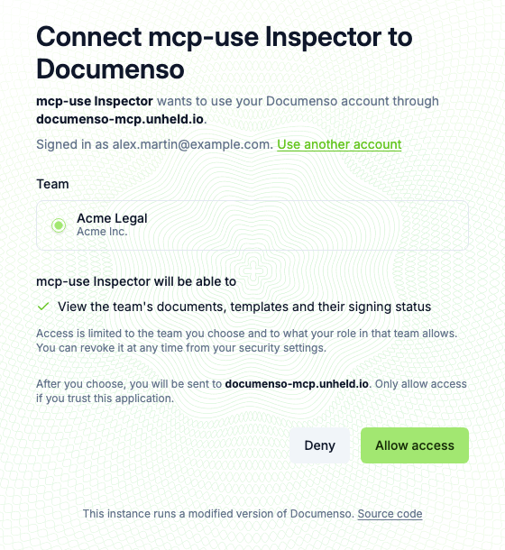
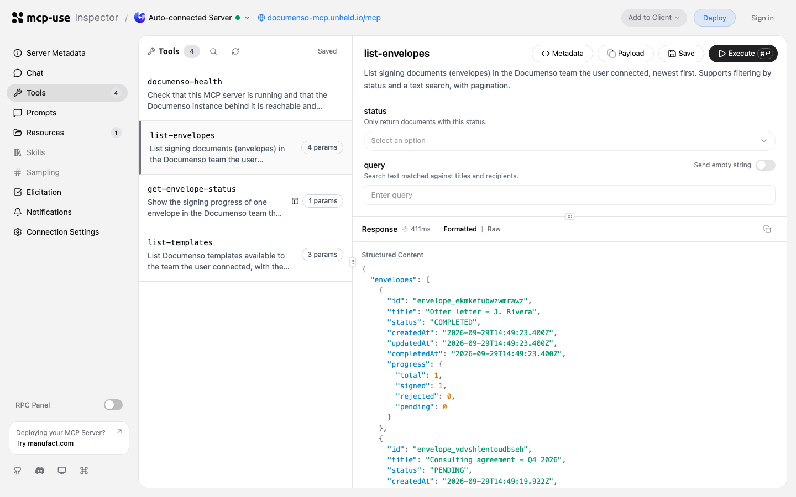
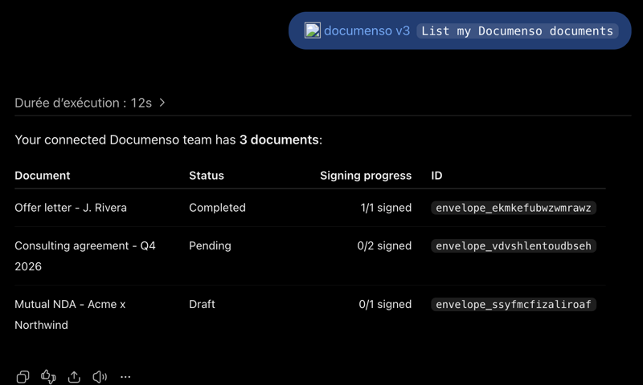
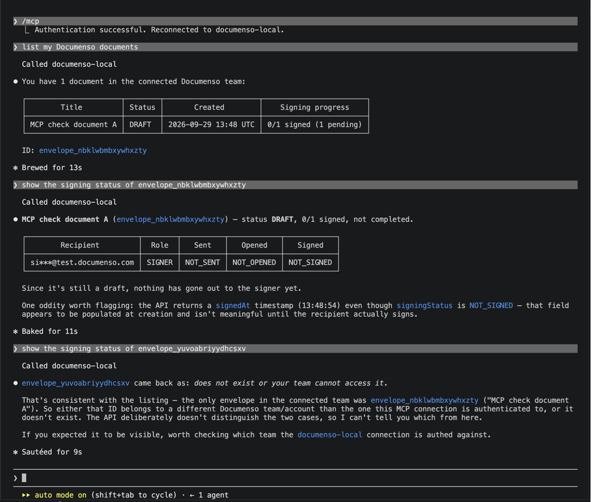
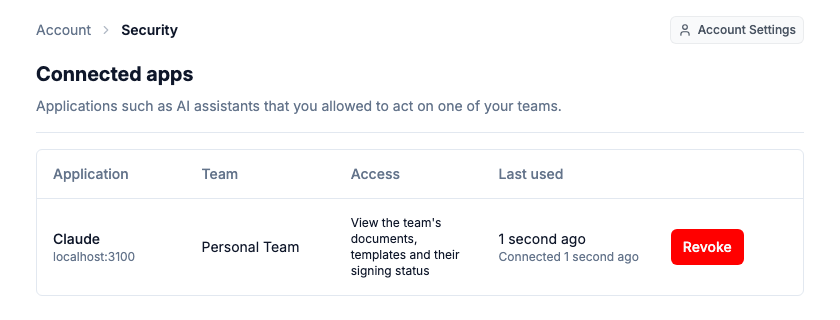
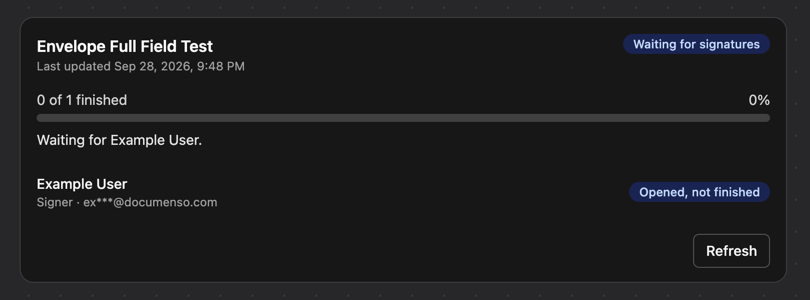

# documenso-mcp

A team-scoped [MCP](https://modelcontextprotocol.io) server for [Documenso](https://github.com/documenso/documenso), built with [mcp-use](https://docs.mcp-use.com). It lets ChatGPT and Claude list and inspect Documenso documents for a team the user chose, and will prepare and send them.

Users connect in one click: the assistant opens Documenso, the user signs in, picks a team and approves. No API token to copy, no second account. That works because Documenso itself is the OAuth server, through an [OAuth 2.1 authorization server I added in a fork of Documenso](https://github.com/MohamedBenDaamar/documenso/blob/feat/oauth-server/OAUTH.md).

> **Status (v0.3.0):** read-only tools and the signing-status View, with Documenso OAuth. Tested in **ChatGPT** against the [live demo](#live-demo), in **Claude Code** and the mcp-use Inspector, and end to end by [`scripts/check-oauth-flow.ts`](scripts/check-oauth-flow.ts) (20 checks) on both deployments. Drafting and sending come after. This is an independent project, not an official Documenso integration.

## Live demo

| | URL |
|---|---|
| **MCP server** (self-hosted with [`docker/Dockerfile`](docker/Dockerfile)) | `https://documenso-mcp.unheld.io/mcp` |
| **Try it in the browser** | [mcp-use Inspector](https://documenso-mcp.unheld.io/mcp/inspector?server=https%3A%2F%2Fdocumenso-mcp.unheld.io%2Fmcp): click **Authenticate**, sign in to Documenso, allow, then run a tool |
| **Documenso** with the OAuth server | https://documenso.unheld.io ([fork](https://github.com/MohamedBenDaamar/documenso), [OAUTH.md](https://github.com/MohamedBenDaamar/documenso/blob/feat/oauth-server/OAUTH.md)) |
| Same MCP server on Manufact | `https://keen-wave-4xpwv.run.mcp-use.com/mcp` |

Add either MCP URL as a custom connector in Claude or ChatGPT. Sign-ups on the demo Documenso are closed; demo accounts are available on request.

| Documenso consent, live | Inspector after signing in, live |
|---|---|
|  |  |

## Tested in ChatGPT and Claude Code

One-click connection in real hosts: Documenso's consent page, then team-scoped tool calls, including a refused request for another team's document. ChatGPT against the live deployment, Claude Code against a local stack. All screenshots, the Inspector, revocation and what the tests found: [docs/host-testing.md](docs/host-testing.md).

| ChatGPT (live) | Claude Code |
|---|---|
|  |  |

## Connecting

| 1. Documenso's consent page | 2. Revoke any time in Documenso |
|---|---|
|  |  |

1. Add the server as a connector in Claude or ChatGPT (`https://<your-server>/mcp`).
2. The host discovers Documenso from this server's metadata, registers itself, and opens Documenso.
3. Sign in to Documenso, choose the team, check the permissions, and click **Allow access**.
4. Ask for your documents. The assistant only ever sees the team you chose.

## Tools

| Tool | Sign-in | Behavior |
|---|---|---|
| `documenso-health` | Not required | Server version and Documenso reachability. No team data. |
| `list-envelopes` | `envelopes:read` | The team's documents, filterable by status and text, paginated. |
| `get-envelope-status` | `envelopes:read` | Signing progress of one envelope, with an interactive [signing-status View](#signing-status-view). Recipient emails are masked. |
| `list-templates` | `envelopes:read` | Team templates and the recipient roles each expects. |
| `prepare-from-template`, `preview-distribution`, `distribute-envelope` | Planned: `envelopes:write`, `envelopes:send` | Draft first; sending will need the send scope, approved separately, plus a single-use confirmation. |

## Signing-status View

In hosts that support MCP Apps, `get-envelope-status` renders a card with the status, a progress bar, what happens next, each recipient's state and a Refresh button. Refresh calls `get-envelope-status` again through the same signed-in, team-scoped path. The View changes nothing, and hosts without Views get the same information as text.



The View loads no external scripts, fonts, images or APIs, so it declares no extra CSP domains. Its bundle contains no server code (`views/signing-status/`).

## How access works

- **Documenso is the authorization server.** This server's protected resource metadata points MCP clients at Documenso, which handles registration, sign-in, consent and tokens ([ADR 0002](docs/adr/0002-documenso-oauth.md)).
- **Every token is checked with Documenso** before any tool code runs: it must be active and issued for this server (`aud`), otherwise the request gets HTTP 401. Results are cached for 30 seconds at most.
- **Documenso enforces the rest** on every API call: the team chosen at consent, the approved scopes, and the user's role in that team.
- **This server stores nothing.** No tokens, no database, no encryption keys.

Details, including revocation and known limitations: [docs/auth.md](docs/auth.md).

## Run locally

Requirements: Node 24 and the [Documenso fork](https://github.com/MohamedBenDaamar/documenso) running locally ([docs/local-backend.md](docs/local-backend.md)).

1. In Documenso's `.env`, allow this server as an OAuth resource and restart Documenso:

   ```bash
   NEXT_PRIVATE_OAUTH_RESOURCES="http://localhost:3100/mcp"
   ```

2. Start this server:

   ```bash
   npm ci
   cp .env.example .env    # DOCUMENSO_URL=http://localhost:3000
   npm run dev
   ```

- MCP endpoint: http://localhost:3100/mcp
- Inspector: http://localhost:3100/mcp/inspector

## Checks

```bash
npm run typecheck
npm test                  # 62 unit tests
npm run build             # server and View bundles

./scripts/check-auth-wiring.sh http://localhost:3100
node --env-file=.env.test.local scripts/check-oauth-flow.ts http://localhost:3100
```

- `check-auth-wiring.sh` needs no credentials. It checks the metadata, that signed-out clients can list tools and call `documenso-health`, and that every Documenso tool answers HTTP 401 with a challenge for missing, forged or wrong-kind tokens.
- `check-oauth-flow.ts` runs the real flow with two ordinary Documenso accounts ([`.env.test.example`](.env.test.example)): discovery, registration, sign-in, consent, token exchange, every tool, team isolation between the two users, a token without the read scope (403), forged tokens (401), and revocation.
- CI runs typecheck, tests and the build on every pull request.

Deployment on Manufact or on your own server with Docker: [docs/deploy.md](docs/deploy.md).

## Security notes

- Tokens that are not Documenso access tokens are refused before any network call; Documenso refresh tokens and API tokens are not accepted as access tokens.
- If Documenso cannot confirm a token, the request fails closed and nothing is cached.
- Documenso error bodies, which include stack traces and server paths in development, are never forwarded to the model (`src/documenso/errors.ts`).
- Documenso returns each recipient's signing token in envelope responses. Tools output only allowlisted fields, so signing tokens never reach the model ([docs/api-map.md](docs/api-map.md)).
- Redirects from Documenso are refused, so a token is never sent to another host.

## History

- **v0.3.0:** Documenso OAuth; Supabase sign-in and token linking removed ([ADR 0002](docs/adr/0002-documenso-oauth.md)).
- **[v0.2.0](https://github.com/MohamedBenDaamar/documenso-mcp/tree/v0.2.0):** Supabase sign-in, then pasting a Documenso team API token; tested in Claude and ChatGPT ([docs/host-testing.md](docs/host-testing.md)).

## License

MIT. The Documenso fork it works with is AGPL-3.0; this server only talks to it over HTTP.
