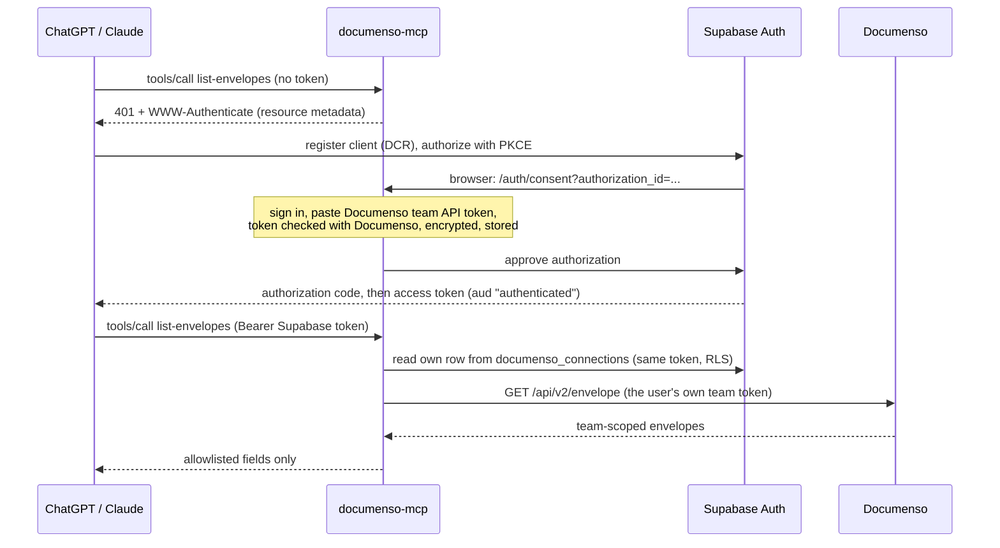

# Authentication and team authorization

## Flow

## Who enforces what

| Boundary | Enforced by |
|---|---|
| Caller identity | mcp-use `oauthSupabaseProvider` verifies the ES256 signature (project JWKS), issuer, audience `authenticated`, expiry and resource binding before any tool code runs. The session check then confirms with Supabase that the session was not revoked. |
| Which Documenso token is used | The token row is read with the caller's own Supabase access token. Row level security (`auth.uid() = user_id`) returns only that user's row. The server has no Supabase key that bypasses RLS. |
| Stored token confidentiality | AES-256-GCM with a server-held key (`CONNECTION_ENCRYPTION_KEY`). The user ID is authenticated data, so a ciphertext moved to another row does not decrypt. Supabase never sees the plaintext. |
| Which envelopes a token can see | Documenso itself: tokens are bound to one team, and membership and role visibility are checked on every request (see [api-map.md](api-map.md)). |
| What reaches the model | Allowlist schemas plus field-by-field output. Recipient signing tokens, owner details, form values and messages are dropped; recipient emails are masked. |

## Revocation

- **Disconnect team** on `/auth/account` deletes the stored token row.
- **Revoke access** on `/auth/account` revokes the application's Supabase OAuth grant, which deletes its sessions and refresh tokens.
  - Supabase access tokens are signed JWTs, so signature checks alone keep accepting them until they expire (up to an hour). Tested: after a revoke, the old token still reached tool code.
  - `src/auth/session-check.ts` wraps the Supabase provider. After the signature check, it asks Supabase `GET /auth/v1/user`, which answers 403 `session_not_found` for a revoked session, and rejects the token as `invalid_token` (HTTP 401 with a `WWW-Authenticate` challenge).
  - Results are cached for 30 seconds per token hash, so a revoke takes effect within 30 seconds. If Supabase is unreachable the request fails closed.
- Revoking the token in Documenso, or removing the user from the team, makes the next tool call fail with a "reconnect" message, because Documenso rejects the token.

## Known limitations

- **No per-tool OAuth scopes.** Supabase's OAuth server only issues `openid`, `profile`, `email`, `phone` and `offline_access`. Write tools (a later PR) are protected by server-side, single-use confirmation tokens instead of OAuth scopes.
- **One Documenso team per user.** The table key is the user ID.
- **The token's permissions are the Documenso user's.** A token created by a team admin carries that admin's visibility. Documenso only lets admins and managers create tokens.
- **Forged tokens without `kid` get HTTP 500, not 401 (mcp-use 2.7.0).** During Supabase key rotation the JWKS has two ES256 keys. A token with no `kid` then makes `jose` throw `JWKSMultipleMatchingKeys`, which mcp-use's `isCredentialFailure` does not list. The request still fails closed, so no tool code runs. `scripts/check-auth-wiring.sh` reports it as `WARN`. Genuine Supabase tokens always carry `kid`.
- The consent page uses email and password sign-in through Supabase. Test users are created in the Supabase dashboard with **Auto Confirm User**.
