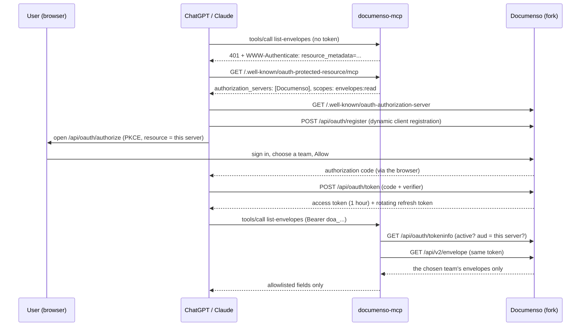

# Authentication and team authorization

Documenso is this server's OAuth authorization server. Users connect by signing in to Documenso and approving access for one team; this server never sees a password or stores a token. Why this design: [ADR 0002](adr/0002-documenso-oauth.md). The Documenso side: [OAUTH.md in the fork](https://github.com/MohamedBenDaamar/documenso/blob/main/OAUTH.md).

## Flow

## Who enforces what

| Boundary | Enforced by |
|---|---|
| Caller identity | Documenso: the user signs in on Documenso's own pages, and the token is issued to that user. |
| Token validity | `src/auth/documenso-oauth.ts` asks Documenso's `tokeninfo` endpoint before any tool code runs. Inactive, expired, revoked or malformed tokens get HTTP 401 with a `WWW-Authenticate` challenge, so clients sign the user in again. Anything that is not a Documenso access token (`doa_…`) is refused without a network call. |
| Audience | The same check requires `aud` to equal this server's resource URL. A token the user granted to another MCP server that trusts the same Documenso is refused. |
| Scope | mcp-use requires `envelopes:read` for every Documenso tool. Documenso checks scopes again on every API call; write and send tools will declare `envelopes:write` and `envelopes:send`. |
| Which team | Documenso: the team is fixed when the user approves, and the API ignores any team header for these tokens. |
| Which envelopes | Documenso: team membership and role-based visibility are checked on every request (see [api-map.md](api-map.md)). |
| What reaches the model | Allowlist schemas plus field-by-field output. Recipient signing tokens, owner details, form values and messages are dropped; recipient emails are masked. |
| Token storage | None. The bearer token is used for the duration of the request; the verification cache is keyed by a SHA-256 hash of the token and holds no token. |

## Caching and failure

- Verification results are cached for 30 seconds per token, and never past the token's expiry.
- If Documenso cannot answer (network error or 5xx), the request fails closed and nothing is cached.
- Documenso's error bodies, which include stack traces in development, are never forwarded (`src/documenso/errors.ts`).

## Revocation

| How | Effect here |
|---|---|
| Documenso **Settings → Security → Connected apps → Revoke** | Documenso refuses the token at once, so tool calls fail with a "reconnect" message; within 30 seconds this server also answers 401. |
| The host revokes the token (`/api/oauth/revoke`) | Same. |
| The user leaves the team, or is removed | Same: Documenso checks membership on every call. |
| A refresh token is used twice | Documenso treats it as leaked and revokes the whole grant. |

## Known limitations

- **Documenso's API does not check `aud` itself.** A token issued for this server also works directly against Documenso's API, within its scopes. The audience check protects MCP servers from each other, not Documenso from its own tokens.
- **One team per connection.** To use a second team, connect again and choose it.
- **Up to 30 seconds** can pass before this server itself stops accepting a revoked token. Documenso refuses it immediately, so no data is returned in the meantime.
- **Requires the Documenso fork.** Stock Documenso has no OAuth server; see ADR 0002.
