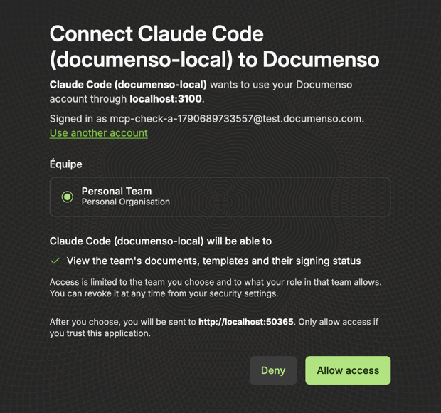
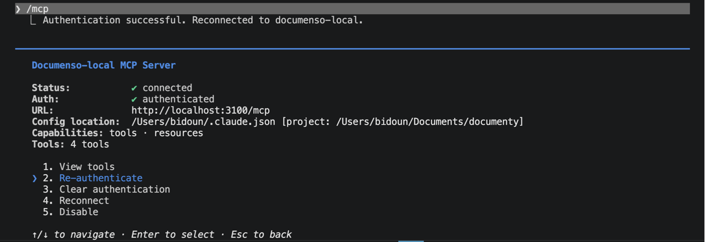
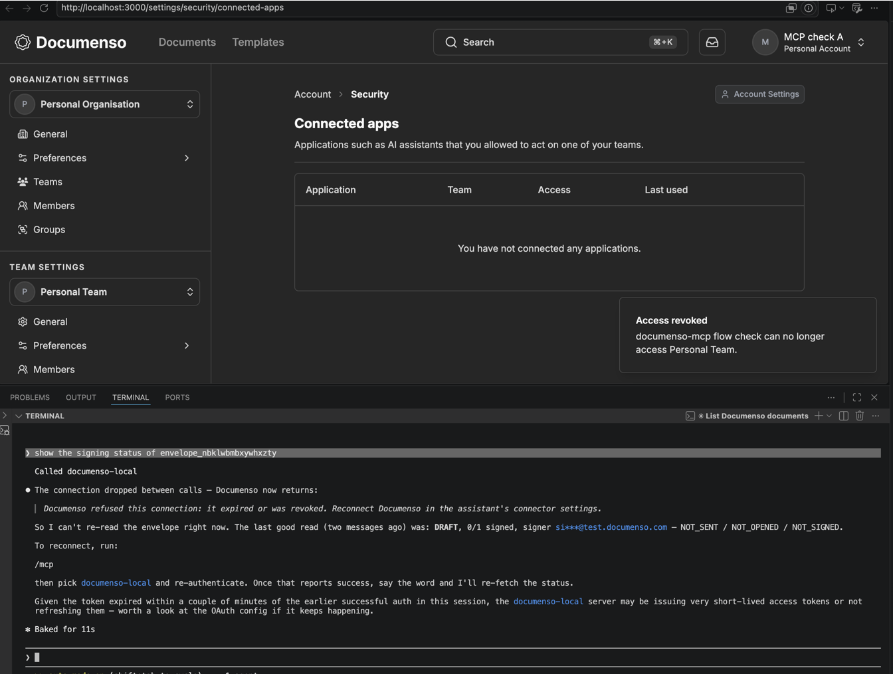
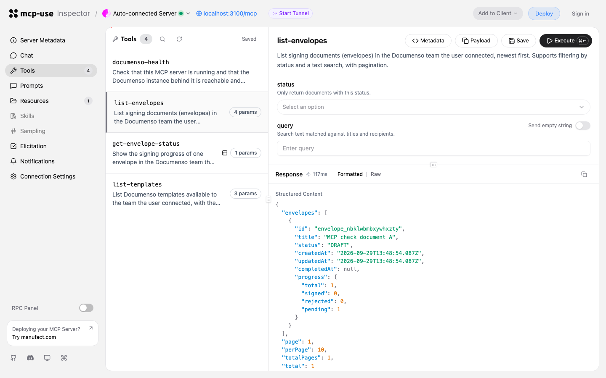

# Testing in MCP hosts

| Version | Sign-in | Hosts tested |
|---|---|---|
| **v0.3.0** | Documenso OAuth ([ADR 0002](adr/0002-documenso-oauth.md)) | [Claude Code](#v030-claude-code-local) and the [mcp-use Inspector](#v030-mcp-use-inspector-local), against a local stack. Claude and ChatGPT follow once Documenso runs at a stable public URL. |
| v0.2.0 | Supabase plus a pasted Documenso API token | [Claude and ChatGPT](#v020-claude-and-chatgpt-deployed), against the Manufact deployment |

## v0.3.0: Claude Code (local)

Tested 2026-09-29 with Claude Code 2.1.220, branch `feat/documenso-oauth`, against the Documenso fork (`feat/oauth-server`) running locally. Test user A has one draft document in its team; test user B has one in another team.

```bash
claude mcp add --transport http documenso-local http://localhost:3100/mcp
```

Then `/mcp` → `documenso-local` → **Authenticate**. Claude Code found Documenso through this server's protected resource metadata, registered itself as "Claude Code (documenso-local)" with dynamic client registration, and opened Documenso in the browser with a loopback callback on a random port (50365), which Documenso accepts for desktop apps.

| 1. Documenso's consent page | 2. Connected and authenticated |
|---|---|
|  |  |

### Tool calls


| Prompt | Result |
|---|---|
| `list my Documenso documents` | One document, "MCP check document A": only team A's |
| `show the signing status of envelope_nbklwbmbxywhxzty` | DRAFT, one signer with a masked email, nothing sent |
| `show the signing status of envelope_yuvoabriyydhcsxv` (team B's) | "does not exist or your team cannot access it", the same answer as for a missing envelope |

Claude pointed out that the recipient had a `signedAt` although it had not signed. The timestamp came from Documenso's seed data, which sets one on every recipient; `get-envelope-status` now reports `signedAt` only for recipients who have signed.

### Revocation

The user revoked the connection in Documenso under **Settings → Security → Connected apps**. The next tool call was refused at once with the reconnect message:



## v0.3.0: mcp-use Inspector (local)

The Inspector at `http://localhost:3100/mcp/inspector`, driven in a browser: **Authenticate** → Documenso sign-in → consent ("Connect mcp-use Inspector to Documenso") → back in the Inspector, authenticated. `list-envelopes` returned team A's document only.



## v0.3.0: scripted check

`scripts/check-oauth-flow.ts` runs the same path as a client would, with two accounts, and checks what a person cannot easily see: HTTP status codes, `WWW-Authenticate` challenges, `state` and `iss` in the redirect, a token without the read scope (403), forged and API tokens (401), and revocation. Result against the local stack: 20 of 20 checks passed.

## v0.2.0: Claude and ChatGPT (deployed)

These results predate the switch to Documenso OAuth. The tools, their output and the View have not changed since.

Tested 2026-09-29 against the deployed server `https://keen-wave-4xpwv.run.mcp-use.com/mcp`, commit `ed6d5aa`.

- **Users:** the Team A test user, signed in through the server's consent page (Supabase OAuth with dynamic client registration). Each host registered its own OAuth client.
- **Data:** Documenso is the local test instance behind an ngrok tunnel, with seeded data only.

The same three prompts were sent in each host:

1. `List my Documenso documents`
2. `Show the signing status of envelope_nuwxdimowvbthehz`, a Team A document
3. `Show the signing status of envelope_oztivihvcuexaaxa`, a **Team B** document, which must be refused

### Claude

Connector added under **Settings → Connectors → Add custom connector**, with authentication set to **"Sign in now"**.

| List | Signing-status View | Team B envelope |
|---|---|---|
|  |  |  |

### ChatGPT

App created in **developer mode**: Settings → Security and login → Developer mode, then Plugins → **+**, with OAuth.

| List | Signing-status View | Team B envelope |
|---|---|---|
|  |  |  |

### Server log for both sessions

From `npx mcp-use deployments logs`, with liveness probes removed:

```
initialize Anthropic/1.0.0 /mcp 200
GET /.well-known/oauth-protected-resource/mcp 200
GET /auth/consent 200
POST /auth/signin 303
{"event":"connection_undecryptable"}
POST /auth/documenso 303
POST /auth/consent 303
tools/call list-envelopes /mcp 200 client=Anthropic/ClaudeAI/1.0.0
resources/read ui://views/signing-status.html /mcp 200 client=claude-ai/0.1.0
tools/call get-envelope-status /mcp 200 client=Anthropic/ClaudeAI/1.0.0
tools/call get-envelope-status /mcp 200 client=Anthropic/ClaudeAI/1.0.0 ERROR That Documenso item does not exist or your team cannot access it.
POST /auth/consent 303
tools/call list-envelopes /mcp 200 client=openai-mcp/1.0.0
resources/read ui://views/signing-status.html /mcp 200 client=openai-mcp/1.0.0
tools/call get-envelope-status /mcp 200 client=openai-mcp/1.0.0
tools/call get-envelope-status /mcp 200 client=openai-mcp/1.0.0 ERROR That Documenso item does not exist or your team cannot access it.
```

The `connection_undecryptable` line is the development-key token being ignored in production before the user linked it again. ChatGPT reused the linked token, so its consent step needed only **Allow**.

### Findings

- **Claude's connector setup auto-detects "No sign-in"** for this server, because `mixedAuth` lets anyone list tools and call `documenso-health`. Choose **"Sign in now"**, or "Sign in when needed", explicitly.
- **ChatGPT labels the View "CSP disabled".** The View resource declares its CSP in the MCP Apps standard key, `_meta.ui.csp` (connect and resource domains limited to the server's own origin). ChatGPT looks for `_meta["openai/widgetCSP"]`. mcp-use 2.7.1 (and `2.7.2-canary.7`) emits only the standard key. Its View resources are also registered outside the `resources/read` middleware, so an app cannot add the ChatGPT key itself. The card renders and works; only the label is affected. This will be reported to mcp-use.
- **Dates follow the host's locale.** Both hosts rendered "28 sept. 2026, 21:48" for a French-language account.
