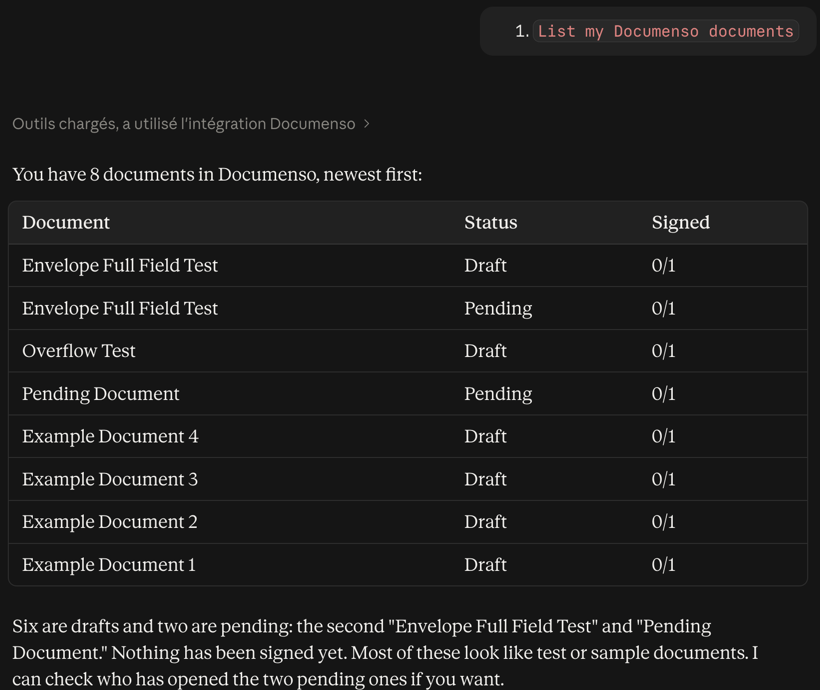
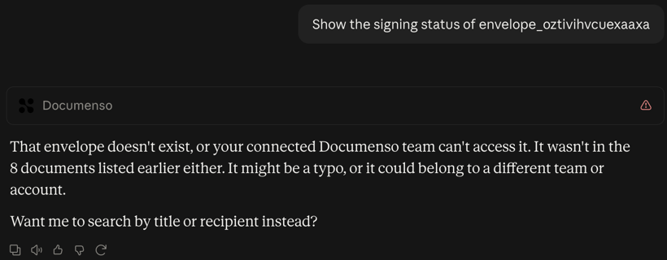
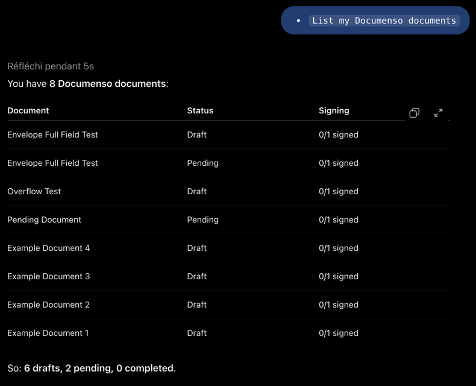
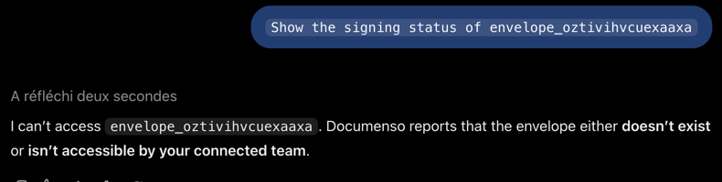

# Testing in Claude and ChatGPT

Tested 2026-09-29 against the deployed server `https://keen-wave-4xpwv.run.mcp-use.com/mcp`, commit `ed6d5aa`.

- **Users:** the Team A test user, signed in through the server's consent page (Supabase OAuth with dynamic client registration). Each host registered its own OAuth client.
- **Data:** Documenso is the local test instance behind an ngrok tunnel, with seeded data only.

The same three prompts were sent in each host:

1. `List my Documenso documents`
2. `Show the signing status of envelope_nuwxdimowvbthehz`, a Team A document
3. `Show the signing status of envelope_oztivihvcuexaaxa`, a **Team B** document, which must be refused

## Claude

Connector added under **Settings → Connectors → Add custom connector**, with authentication set to **"Sign in now"**.

| List | Signing-status View | Team B envelope |
|---|---|---|
|  |  |  |

## ChatGPT

App created in **developer mode**: Settings → Security and login → Developer mode, then Plugins → **+**, with OAuth.

| List | Signing-status View | Team B envelope |
|---|---|---|
|  |  |  |

## Server log for both sessions

From `npx mcp-use deployments logs`, with liveness probes removed:

```
initialize Anthropic/1.0.0 /mcp 200
GET /.well-known/oauth-protected-resource/mcp 200
GET /auth/consent 200
POST /auth/signin 303
{"event":"connection_undecryptable"}
POST /auth/documenso 303
POST /auth/consent 303
tools/call list-envelopes /mcp 200 client=Anthropic/ClaudeAI/1.0.0
resources/read ui://views/signing-status.html /mcp 200 client=claude-ai/0.1.0
tools/call get-envelope-status /mcp 200 client=Anthropic/ClaudeAI/1.0.0
tools/call get-envelope-status /mcp 200 client=Anthropic/ClaudeAI/1.0.0 ERROR That Documenso item does not exist or your team cannot access it.
POST /auth/consent 303
tools/call list-envelopes /mcp 200 client=openai-mcp/1.0.0
resources/read ui://views/signing-status.html /mcp 200 client=openai-mcp/1.0.0
tools/call get-envelope-status /mcp 200 client=openai-mcp/1.0.0
tools/call get-envelope-status /mcp 200 client=openai-mcp/1.0.0 ERROR That Documenso item does not exist or your team cannot access it.
```

The `connection_undecryptable` line is the development-key token being ignored in production before the user linked it again. ChatGPT reused the linked token, so its consent step needed only **Allow**.

## Findings

- **Claude's connector setup auto-detects "No sign-in"** for this server, because `mixedAuth` lets anyone list tools and call `documenso-health`. Choose **"Sign in now"**, or "Sign in when needed", explicitly.
- **ChatGPT labels the View "CSP disabled".** The View resource declares its CSP in the MCP Apps standard key, `_meta.ui.csp` (connect and resource domains limited to the server's own origin). ChatGPT looks for `_meta["openai/widgetCSP"]`. mcp-use 2.7.1 (and `2.7.2-canary.7`) emits only the standard key. Its View resources are also registered outside the `resources/read` middleware, so an app cannot add the ChatGPT key itself. The card renders and works; only the label is affected. This will be reported to mcp-use.
- **Dates follow the host's locale.** Both hosts rendered "28 sept. 2026, 21:48" for a French-language account.
